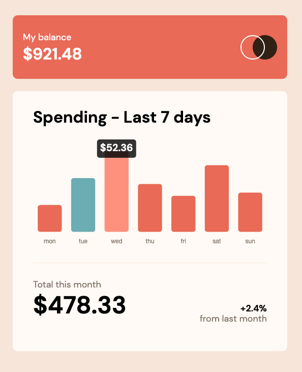

# Frontend Mentor - Expenses chart component solution

This is a solution to the [Expenses chart component challenge on Frontend Mentor](https://www.frontendmentor.io/challenges/expenses-chart-component-e7yJBUdjwt). Frontend Mentor challenges help you improve your coding skills by building realistic projects.

## Table of contents

- [Overview](#overview)
  - [The challenge](#the-challenge)
  - [Screenshot](#screenshot)
  - [Links](#links)
- [My process](#my-process)
  - [Built with](#built-with)
  - [What I learned](#what-i-learned)
- [Author](#author)

## Overview

### The challenge

Users should be able to:

- View the bar chart and hover over the individual bars to see the correct amounts for each day
- See the current day’s bar highlighted in a different colour to the other bars
- View the optimal layout for the content depending on their device’s screen size
- See hover states for all interactive elements on the page
- **Bonus**: Use the JSON data file provided to dynamically size the bars on the chart

### Screenshot

### Links

- Solution URL: [View code on github](https://github.com/adamwinzdesign/expenses_chart_component_challenge)
- Live Site URL: [Live site](https://expenses-component-challenge.netlify.app/)

## My process

### Built with

- Semantic HTML5 markup
- Flexbox
- [React](https://reactjs.org/) - JS library
- [TailwindCSS](https://tailwindcss.com/) - For styles
- [React ChartJS](https://react-chartjs-2.js.org/)

### What I learned

This was my first in-depth experience with ChartJS. I'm definitely looking forward to using this package again in another project, especially one that requires dynamic data fetching, rather than the hard-coded data used here.

## Author

- Linkedin - [Adam Winzenburger](https://www.linkedin.com/in/adam-winzenburger/)
- Frontend Mentor - [Frontend Mentor](https://www.frontendmentor.io/profile/adamwinzdesign)
- Github - [adamwinzdesign](https://github.com/adamwinzdesign)
